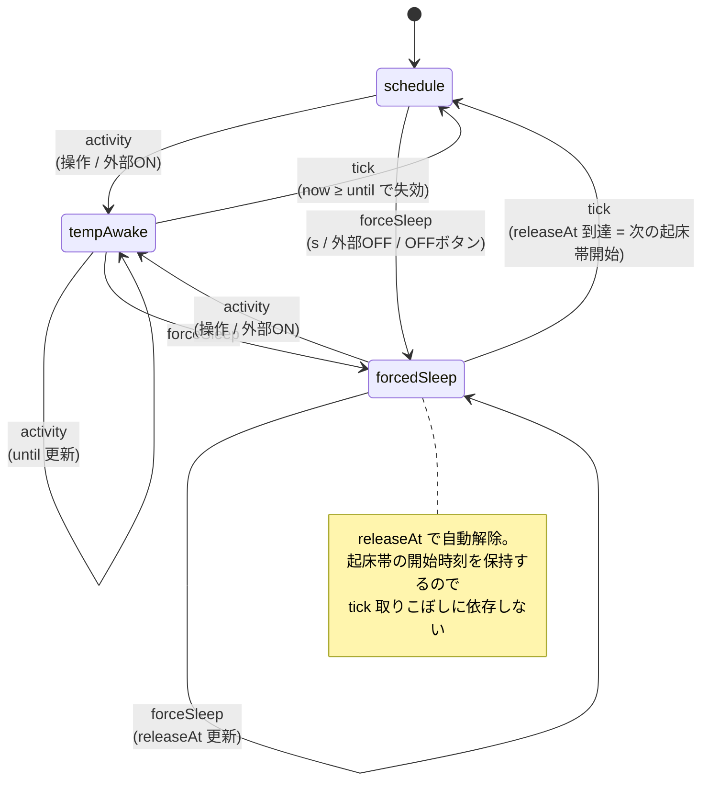
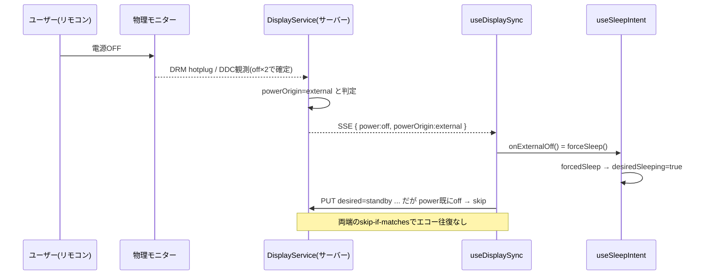

# スリープ / ディスプレイ連動 仕様

asamiru の「スリープ（画面を暗くして外部リクエストも止める）」と「物理モニター連動」の仕様をまとめる。実装の責務分割や ADR の背景は次を参照。

- 設計概要: [ARCHITECTURE.md](../ARCHITECTURE.md) の「スリープ / モニター連動」
- 意思決定: [ADR: client sleep intent / server display state](adr/2026-06-03-client-sleep-intent-server-display-state.md)
- 再設計の計画と実装: [スリープ再設計の実装計画](issues/2026-06-04-sleep-redesign-plan.md)（Plan A/B/C/D。Codex レビュー反映済み）

この仕様は2026-06-04 のスリープ再設計（mode 化）後の状態を反映する。設計提案からの変遷は末尾「実装履歴」を参照。

## 何をするものか

リビング常設のダッシュボードを「見たいときだけ」表示する。無操作タイマー（idle 検知）は使わず、曜日つきスケジュール＋手動操作で制御する。スリープ中は `Dashboard` をアンマウントし、データ取得サブツリーごと外して外部 API ポーリングを止める。さらに Raspberry Pi 実機では、物理モニターの電源（DDC/CI standby・DRM hotplug）とも双方向に連動する。

設計の背骨は一つ。

- アプリの「スリープ意図」はクライアントが持つ（スケジュール・一時起床・手動スリープ）。
- 物理モニターの「実状態」はサーバーが持つ（DRM 接続・DDC 観測値・desired power）。
- 両者は同じ意味の状態を二重に持たない。サーバーが外部操作と判定した ON/OFF を、クライアントはキー入力と同じ「ユーザー操作」として意図へ取り込む。

## 状態モデル

状態は3つのレイヤーに分かれている。

クライアントが持つスリープ意図（`useSleepIntent`）。意図は判別共用体 `SleepIntent` の単一の mode で表す。

```ts
type SleepIntent =
  | { mode: "schedule" }                  // スケジュールに従う（既定）
  | { mode: "tempAwake"; until: number }  // 期限つき一時起床（until は ms epoch）
  | { mode: "forcedSleep"; releaseAt: number | null }; // 強制スリープ。releaseAt で自動解除
```

| 値 | 意味 |
| --- | --- |
| `now` | 境界・期限の再評価に使う現在時刻（15秒 tick で更新） |
| `intent.mode` | 今どの理由でスリープ/起床しているか |
| `tempAwake.until` | 一時起床の期限。`now < until` の間だけ起きている |
| `forcedSleep.releaseAt` | 自動解除時刻（= 次のスケジュール起床帯の開始）。`null` は操作・外部ONでのみ解除 |

「何を記憶するか」は mode が一手に引き受ける。`manualSleeping` のような bool フラグも、`awakeUntil` のような裸の時刻もない。

サーバーが持つ物理状態（`DisplayService` / `DisplayStatus`、抜粋）。クライアントは SSE で観測値だけ受け取る。

| 値 | 意味 |
| --- | --- |
| `power` | `on` / `off` / `unknown`。OFF は連続2回観測で確定 |
| `powerOrigin` | その電源状態の主体。`external`（人が操作）/ `command`（自分が送った）/ `unknown` |
| `desiredPower` | サーバーへ要求中の目標 `on` / `standby` |
| `commandPhase` | `idle` / `commanding` / `settling` |

クライアントが設定として持つスケジュール（`SleepSettings`、localStorage 永続）。

| 値 | 意味 |
| --- | --- |
| `enabled` | スケジュール自動スリープの ON/OFF |
| `windows` | 「起きている時間帯」の配列（曜日＋HH:MM 範囲、日付またぎ可） |
| `manualWakeDurationMin` | 操作後、自動スリープへ戻るまでの分 |

### 派生式

表示するかどうかは、mode と `now`・設定から純粋関数で都度算出する。

```
desiredSleeping = mode で決まる:
  forcedSleep  → releaseAt 未到達なら true（到達後はスケジュール評価）
  tempAwake    → until 未到達なら false（失効後はスケジュール評価）
  schedule     → scheduleSleeping(now)

scheduleSleeping(now) = enabled && windows.some(有効) && !scheduleAwakeNow(now)

showSleepScreen = desiredSleeping || (display.enabled && display.power === "off")
```

`desiredSleeping` がアプリの意図、`showSleepScreen` が実際に黒画面を出すかの判定。後者だけが物理状態を混ぜる（受動ゲート、後述）。`forcedSleep`/`tempAwake` の解除判定を selector 側にも持つことで、tick が走る前のレンダーでも正しく評価できる（tick は mode の正規化を担当）。

## 意図のステートマシン

mode はそのまま状態機械の状態になる。図とコード（`sleepIntentReducer`）が1:1で対応する。



各 mode の `desiredSleeping`（黒画面になる側）。

```
mode         条件                       desiredSleeping
schedule     起床帯の中                 false   普通に表示
schedule     起床帯の外（スリープ帯）   true    スケジュールでスリープ
tempAwake    now < until                false   操作で一時起床
forcedSleep  releaseAt 未到達 or null    true    手動で強制スリープ
```

アクション（`sleepIntentReducer`）。

- `activity`：`tempAwake{until: now + 起床分}` へ。どの mode からでも同じ。旧 `wake`（復帰）と `extend`（延長）を統合したもの。
- `forceSleep`：`forcedSleep{releaseAt}` へ。`releaseAt` は dispatch 時に `nextScheduleWakeStartAfter`（次の起床帯開始）で算出する。有効な起床帯が無い／スケジュール無効なら `null`。
- `tick`：`now` を進める。`tempAwake` が `now ≥ until`、`forcedSleep` が `releaseAt ≤ now` に達していたら `schedule` へ正規化する。
- `resync`：設定変更の反映。`tempAwake` 中は `until` を、`forcedSleep` 中は `releaseAt` を取り直す（`schedule` は無変化）。

## 操作仕様

window への capture リスナ1か所（`useGlobalInput`）で全入力を捌く。スリープ中か起きているかで分岐する。

スリープ中（`showSleepScreen=true`）はとにかく復帰優先。

- 任意の `keydown` / `pointerdown` → `activity`（復帰）。直後300msは誤操作抑止。
- `mousemove` は拾わない（微小イベントでの誤復帰防止）。
- 復帰直後のダブルクリックでフルスクリーンが誤発火しないよう、`dblclick` はスリープ中なら何もしない。

起きている間（`showSleepScreen=false`）の操作は基本「アクティビティ」として `activity`。例外だけ特別扱い。

- `s` キー → `forceSleep`（即スリープ）。
- `f` キー / 空白部分のダブルクリック → フルスクリーン切替＋`activity`。ボタン・入力・モーダル上では発火しない。
- テキスト入力中・ダイアログ内・修飾キー（Ctrl/Meta/Alt）併用時 → ショートカットは無効化し `activity` のみ。
- ダッシュボードの時計カードにある「モニターを OFF」ボタン → `sleepNow`（= `forceSleep`）。

## 物理モニター連動

`useDisplaySync` がサーバーの `/api/system/display` と繋がる。初期化はバックオフ付きリトライ（`connectWithRetry`）で行い、サーバー起動前でも自動で接続を確立する。連動の方向は2つ。

意図 → 物理（desired power 送信）。`desiredSleeping` が変わったとき、`standby`（寝る）/ `on`（起きる）をサーバーへ PUT する。ただし最後に観測した `power` が既に目標と一致するなら送らない（skip-if-matches）。サーバー側でも同じ skip-if-matches がかかる。失敗しても warn を出すだけでスリープ自体は失敗させない。

物理 → 意図（外部操作の取り込み）。SSE でモニター状態を購読し、`powerOrigin === "external"` の変化だけを操作として扱う。

- 外部で OFF → `onExternalOff`（= `forceSleep`）。リモコン等でモニターを消したらアプリも寝る。
- 外部で ON → `onExternalOn`（= `activity`）。モニターを点けたらアプリも起きて一時起床に入る。
- 切断中に起きた物理操作は、再接続時に「最後に観測した power との差分」で検知する（瞬間値の `powerOrigin` には頼らない）。

この双方向ループは、両端の skip-if-matches で自己減衰する。外部 OFF を受けて `forceSleep` →`desiredSleeping=true` → standby を送ろうとするが、`power` は既に off なので送らない。エコー的なコマンドの往復は起きない。



### showSleepScreen にだけ物理状態を混ぜる理由

原則は「表示は意図（`desiredSleeping`）で決める」だが、`showSleepScreen` には `(display.enabled && display.power === "off")` を OR している。これは intent とは独立した受動的な表示ゲートで、次の隙間を埋めるフェイルセーフ。

- 外部 ON 要求（`on` を送ったが物理がまだ off）の反映待ちの間。
- 再接続時の差分検知で、直前の観測が `unknown` だったため外部操作として扱えないが、`power` は `off` に更新されるケース。

intent を書き換えないので `activity`（復帰）と競合しない。ここを「物理 off を `forceSleep` へ正規化する」能動的な処理にすると、復帰直後の「on 要求済み・物理まだ off」の隙間で寝かせ直してしまう。だから受動ゲートのまま残している。モニター連動が無効なら `power` は常に `unknown` なので、この項は一切効かない。

## 直感的でない点（既知の割り切り）

現状は意図的にこうなっている部分の棚卸し。

起床帯のど真ん中で手動スリープすると、その起床帯では戻らず次の起床帯で自動復帰する。`forceSleep` の `releaseAt` は「操作時刻より後に始まる次の起床帯の開始」を指す。起床帯の中で `s` を押すと、今いる窓の開始は過去なので `releaseAt` は次の窓になる（= 今日の残りは寝て、翌朝の窓で復帰）。操作・外部ON すれば即復帰する。これは `forcedSleep` の解除条件として時刻ベースで仕様化されており、以前の「流入エッジを tick がたまたま拾う」実装の取りこぼしリスクは解消した。

外部 OFF の確定に最大10秒かかる。サーバーは DDC 誤読を避けるため OFF を連続2回（POLL 5秒間隔）観測して確定する。手でモニターを消しても、最悪10秒は `power` が前の値のままで黒画面に切り替わらない。常設 kiosk では手動 OFF が稀なので許容している。

モニター制御の失敗はサイレント。`putDesiredPower` が失敗しても warn ログのみ。アプリ画面は黒くなるが物理モニターは点いたまま（＝黒い画面を表示し続ける）になりうる。リビング用途では実質問題にならないが、状態としてはズレる。

スケジュール評価は15秒 tick 依存。`tempAwake` の失効やスケジュール境界の `schedule` 側評価は最大15秒遅延する（kiosk 常時表示なので軽微）。`forcedSleep` の解除は `releaseAt` の時刻比較なので、tick が大きく飛んでも取りこぼさない。

## 実装履歴

このセクションは当初の改善提案 A〜E と、その実装結果の記録。

提案の初稿（フラグ管理時代の `manualSleeping`＋`awakeUntil` を前提に書いた A〜E）は [スリープ再設計の実装計画](issues/2026-06-04-sleep-redesign-plan.md) へ移し、Codex レビューを経て次のとおり実装した（2026-06-04）。

- A. モニター連動の初期化リトライ … 実装済み。`useDisplaySync` の初回 GET を `connectWithRetry`（1s→30s バックオフ、`{enabled:false}` 終端、cancelled ガード）へ置換。起動順序で連動が永久に無効化される問題を解消。
- B. 表示判定の整理 … 当初案「intent へ正規化して合成点を消す」は、復帰と競合するため却下。`effectiveSleeping` を `showSleepScreen` に改名し「受動的な表示ゲート」と明示する方針へ変更（上記参照）。
- C. 起床帯中の手動スリープ … `forcedSleep.releaseAt` による解除時刻の仕様化で実現。「次の起床帯で復帰」を時刻ベースで明文化。
- D. フラグ管理をやめ明示 mode へ … 実装済み。`SleepIntent` 判別共用体（`schedule`/`tempAwake`/`forcedSleep`）へ統一し、`wake`+`extend` を `activity` に統合、流入エッジ検出を `releaseAt` で廃止。B・C を内包。
- E. サーバー権威化 … 見送り（ADR で棄却済み）。複数クライアント対応が要件になったら再検討。

コミット: `fdab01c`（A）/ `3993ddb`（D・C・B）/ マージ `efef6b5`。
