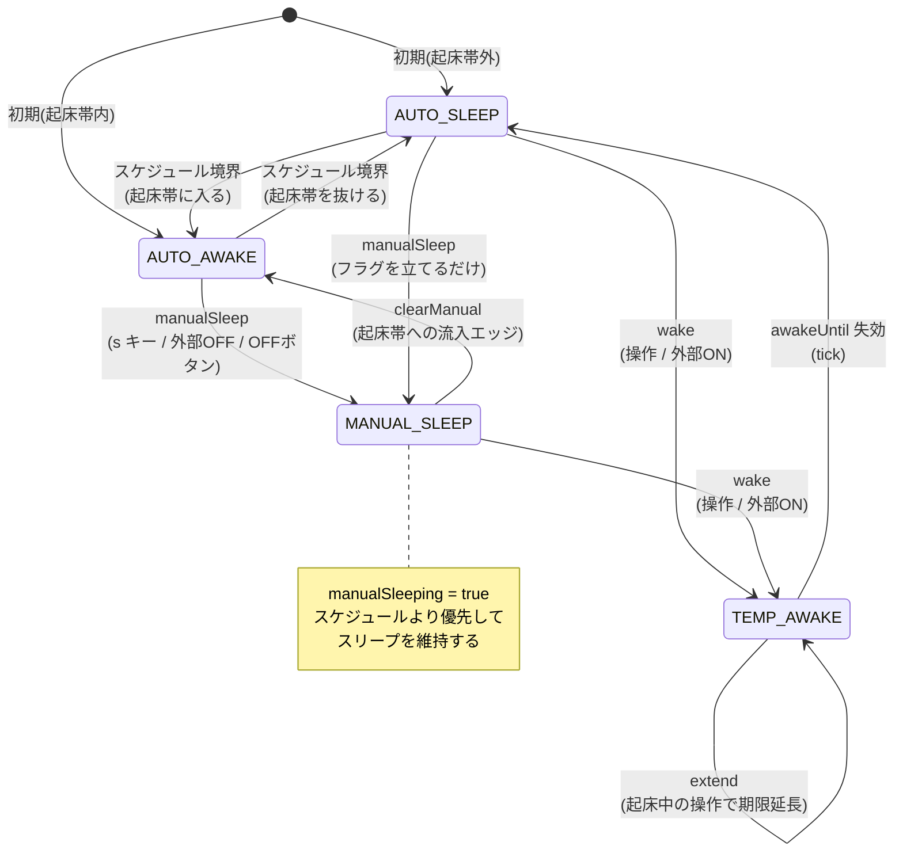
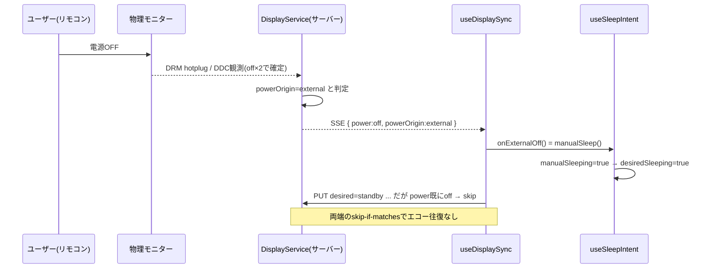

# スリープ / ディスプレイ連動 仕様

asamiru の「スリープ（画面を暗くして外部リクエストも止める）」と「物理モニター連動」の仕様をまとめる。実装の責務分割や ADR の背景は次を参照。

- 設計概要: [ARCHITECTURE.md](../ARCHITECTURE.md) の「スリープ / モニター連動」
- 意思決定: [ADR: client sleep intent / server display state](adr/2026-06-03-client-sleep-intent-server-display-state.md)
- 実装経緯: [スリープ機能の実装](issues/2026-06-03-sleep-feature-implementation.md) / [モニター電源連動](issues/2026-06-03-raspberry-pi-monitor-power-integration.md)

この文書の後半「課題と改善提案」は、現状の引っかかりどころと、フラグ管理をやめる類の破壊的な再設計案までを含む。

## 何をするものか

リビング常設のダッシュボードを「見たいときだけ」表示する。無操作タイマー（idle 検知）は使わず、曜日つきスケジュール＋手動操作で制御する。スリープ中は `Dashboard` をアンマウントし、データ取得サブツリーごと外して外部 API ポーリングを止める。さらに Raspberry Pi 実機では、物理モニターの電源（DDC/CI standby・DRM hotplug）とも双方向に連動する。

設計の背骨は一つ。

- アプリの「スリープ意図」はクライアントが持つ（スケジュール・一時起床・手動スリープ）。
- 物理モニターの「実状態」はサーバーが持つ（DRM 接続・DDC 観測値・desired power）。
- 両者は同じ意味の状態を二重に持たない。サーバーが外部操作と判定した ON/OFF を、クライアントはキー入力と同じ「ユーザー操作」として意図へ取り込む。

## 状態モデル

状態は3つのレイヤーに分かれている。

クライアントが持つ生の状態（`useSleepIntent` / reducer）。これだけが永続的に「記憶」する値。

| 値 | 型 | 意味 |
| --- | --- | --- |
| `now` | number | 境界・期限の再評価に使う現在時刻（15秒 tick で更新） |
| `awakeUntil` | number(ms epoch) | 一時起床の期限。`now < awakeUntil` の間だけ起きている |
| `manualSleeping` | boolean | 手動スリープ中か。起床帯でもスリープを維持する |

サーバーが持つ物理状態（`DisplayService` / `DisplayStatus`、抜粋）。クライアントは SSE で観測値だけ受け取る。

| 値 | 意味 |
| --- | --- |
| `power` | `on` / `off` / `unknown`。OFF は連続2回観測で確定 |
| `powerOrigin` | その電源状態の主体。`external`（人が操作）/ `command`（自分が送った）/ `unknown` |
| `desiredPower` | サーバーへ要求中の目標 `on` / `standby` |
| `commandPhase` | `idle` / `commanding` / `settling` |

クライアントが設定として持つスケジュール（`SleepSettings`、localStorage 永続）。

| 値 | 意味 |
| --- | --- |
| `enabled` | スケジュール自動スリープの ON/OFF |
| `windows` | 「起きている時間帯」の配列（曜日＋HH:MM 範囲、日付またぎ可） |
| `manualWakeDurationMin` | 操作後、自動スリープへ戻るまでの分 |

### 派生式

表示するかどうかは、生の状態から純粋関数で都度算出する。記憶しているフラグは `manualSleeping` だけで、「いつ寝るか」は時刻 `awakeUntil` の自然失効に任せる（失効バグが構造的に起きない）。

```
scheduleSleeping = enabled && windows.some(有効) && !scheduleAwakeNow(now)   # スケジュール上スリープ帯か
awake            = now < awakeUntil                                          # 一時起床中か

desiredSleeping  = manualSleeping || (scheduleSleeping && !awake)            # アプリの意図
effectiveSleeping = desiredSleeping || (display.enabled && display.power === "off")  # 実際に黒画面にするか
```

`effectiveSleeping` だけが物理状態（`display.power`）を混ぜる。これは後述するフェイルセーフのための項で、原則は `desiredSleeping` が表示を決める。

## 意図のステートマシン

`manualSleeping` と `awakeUntil` の組み合わせを「今どのモードか」で読み替えると、4つのモードを行き来する状態機械になる。モード自体は保存しておらず、毎回 `now` と設定から再計算される派生ビューである点に注意。



ASCII でのまとめ（`desiredSleeping` 列が黒画面になる側）。

```
モード         manualSleeping  awake   scheduleSleeping  desiredSleeping
AUTO_AWAKE         false       -            false            false   起床帯。普通に表示
TEMP_AWAKE         false      true          true             false   スリープ帯だが操作で一時起床
AUTO_SLEEP         false      false         true             true    スケジュールでスリープ
MANUAL_SLEEP       true        -             -               true    手動で強制スリープ
```

各遷移を起こすアクション（`sleepIntentReducer`）。

- `wake`：`manualSleeping=false`、`awakeUntil = now + manualWakeDurationMin`。スリープから復帰し一時起床する。
- `extend`：`awakeUntil` だけ延長。`manualSleeping` は触らない。起床中の操作で寝るのを先送りする。
- `manualSleep`：`manualSleeping=true`。起床帯でも即スリープへ。
- `clearManual`：`manualSleeping=false`。スケジュール起床帯への「流入エッジ（false→true）」でのみ発火する。
- `resyncAwake`：`manualWakeDurationMin` 設定変更を、現在の一時起床期限へ即反映する（スリープ帯かつ一時起床中のときだけ取り直す）。
- `tick`：`now` を進めるだけ（15秒間隔）。境界・期限の再評価のトリガ。

## 操作仕様

window への capture リスナ1か所（`useGlobalInput`）で全入力を捌く。スリープ中か起きているかで分岐する。

スリープ中（`effectiveSleeping=true`）はとにかく復帰優先。

- 任意の `keydown` / `pointerdown` → `wake`（復帰）。直後300msは誤操作抑止（同じ操作が延長扱いされるのを防ぐ）。
- `mousemove` は拾わない（微小イベントでの誤復帰防止）。
- 復帰直後のダブルクリックでフルスクリーンが誤発火しないよう、`dblclick` はスリープ中なら何もしない。

起きている間（`effectiveSleeping=false`）の操作は基本「アクティビティ」として `extend`。例外だけ特別扱い。

- `s` キー → `manualSleep`（即スリープ）。
- `f` キー / 空白部分のダブルクリック → フルスクリーン切替＋`extend`。ボタン・入力・モーダル上では発火しない。
- テキスト入力中・ダイアログ内・修飾キー（Ctrl/Meta/Alt）併用時 → ショートカットは無効化し `extend` のみ。
- ダッシュボードの時計カードにある「モニターを OFF」ボタン → `sleepNow`（= `manualSleep`）。

## 物理モニター連動

`useDisplaySync` がサーバーの `/api/system/display` と繋がる。方向は2つ。

意図 → 物理（desired power 送信）。`desiredSleeping` が変わったとき、`standby`（寝る）/ `on`（起きる）をサーバーへ PUT する。ただし最後に観測した `power` が既に目標と一致するなら送らない（skip-if-matches）。サーバー側でも同じ skip-if-matches がかかる。失敗しても warn を出すだけでスリープ自体は失敗させない。

物理 → 意図（外部操作の取り込み）。SSE でモニター状態を購読し、`powerOrigin === "external"` の変化だけを操作として扱う。

- 外部で OFF → `onExternalOff`（= `manualSleep`）。リモコン等でモニターを消したらアプリも寝る。
- 外部で ON → `onExternalOn`（= `wake`）。モニターを点けたらアプリも起きて一時起床に入る。
- 切断中に起きた物理操作は、再接続時に「最後に観測した power との差分」で検知する（瞬間値の `powerOrigin` には頼らない）。

この双方向ループは、両端の skip-if-matches で自己減衰する。外部 OFF を受けて `manualSleep` →`desiredSleeping=true` → standby を送ろうとするが、`power` は既に off なので送らない。エコー的なコマンドの往復は起きない。



### effectiveSleeping にだけ物理状態を混ぜる理由

原則は「表示は意図（`desiredSleeping`）で決める」だが、`effectiveSleeping` には `(display.enabled && display.power === "off")` を OR している。これは次の隙間を埋めるフェイルセーフ。

- 外部 OFF の SSE で `setPower("off")` された直後、`manualSleep` の dispatch が反映される前の1レンダー。
- 再接続時の差分検知で、直前の観測が `unknown` だったため `applyExternalPower` を呼べないが、`power` は `off` に更新されるケース。

どちらも「物理は消えているのに意図はまだスリープになっていない」状態で、ここで黒画面を出しておく安全弁。モニター連動が無効なら `power` は常に `unknown` なので、この項は一切効かない。

## 直感的でない点（既知の割り切り）

ここは「だいたい直感的だが一部そうでない」部分の棚卸し。現状は意図的にこうなっている。

起床帯のど真ん中で手動スリープすると、その起床帯を抜けるまで戻ってこない。`manualSleeping` を解除するのは「操作（`wake`）」か「起床帯への“流入エッジ”（`clearManual`）」だけ。起床帯のど真ん中で `s` を押すと流入エッジは既に過ぎているので、操作しない限りその起床帯の残り時間ずっとスリープのまま。実装メモにも「起床帯の中での手動スリープは仕様上の割り切り」と明記されている。

外部 OFF の確定に最大10秒かかる。サーバーは DDC 誤読を避けるため OFF を連続2回（POLL 5秒間隔）観測して確定する。手でモニターを消しても、最悪10秒は `power` が前の値のままで黒画面に切り替わらない。常設 kiosk では手動 OFF が稀なので許容している。

モニター制御の失敗はサイレント。`putDesiredPower` が失敗しても warn ログのみ。アプリ画面は黒くなるが物理モニターは点いたまま（＝黒い画面を表示し続ける）になりうる。リビング用途では実質問題にならないが、状態としてはズレる。

モニター連動の初期化はマウント時の1回きり。`fetchDisplayStatus` が失敗すると `enabled=false` のまま再試行しない。web がサーバーより先に起動した／一時的に GET が失敗した場合、その後サーバーが立っても連動が有効化されない。

スケジュール境界の検知は15秒 tick 依存。`clearManual` のエッジ判定は `scheduleAwakeNow(now)` と `scheduleAwakeNow(now - 15秒)` の比較で近似している。タブのバックグラウンド throttling 等で tick が大きく飛ぶと、流入エッジを取りこぼす可能性がある（kiosk 常時表示なので低リスク）。

## 課題と改善提案

優先度の主観つきで挙げる。ロジックの小修正から、フラグ管理をやめる破壊的な再設計まで。

> 注記: A・B・C・D は [スリープ再設計の実装計画](issues/2026-06-04-sleep-redesign-plan.md) を上位計画として、方針を更新済み。本節は提案の初稿で、確定方針は実装計画を参照のこと。主な更新: A は「SSE 主接続化」ではなく「GET プローブのリトライ＋SSE 定常購読」、B は「intent 統合」ではなく「受動ゲート `showSleepScreen` の明示化」、C は `forcedSleep.releaseAt` による解除時刻の仕様化（流入エッジ検出の廃止）。実装完了時に本節と図を新モデルへ更新する。

### A. モニター連動の初期化リトライ（実害あり・破壊的でない）

現状 `useDisplaySync` の init は1回きりで、失敗すると永久に `enabled=false`。起動順序や瞬断に弱い。

提案：SSE を「常時張りっぱなしの主たる接続」に格上げし、接続できた時点の初期イベントで `enabled` と `power` を確定する設計にする。GET は補助に降格。EventSource は自動再接続するので、サーバーが後から立ち上がっても自然に有効化される。`reconcile`（差分再同期）の枠組みはそのまま再利用できる。これは責務分割を壊さずに堅牢性だけ上げられるので、最初にやる価値が高い。

### B. 表示判定を `desiredSleeping` 一本に正規化（中・準破壊的）

`effectiveSleeping` が物理状態を混ぜているのは、外部 OFF が意図へ反映されるまでの隙間を埋めるフェイルセーフ。これは「二重管理しない」という背骨と表面的に矛盾して見え、読み手を惑わせる。

提案：外部由来の `power` 変化を必ず意図へ正規化し（差分検知で `unknown` のときも、確定した off を `manualSleep` に流す）、表示は `desiredSleeping` だけで決める。`effectiveSleeping` という二つ目の合成点を消せて、「表示＝意図」が一直線になる。フェイルセーフを別系統で持つ必要がなくなる。

### C. 起床帯中の手動スリープを「ワンショット」に（中・仕様変更）

「起床帯のど真ん中で `s` を押すと抜けるまで戻らない」は最も非直感的。`manualSleeping` という無期限フラグと、`clearManual` の流入エッジ依存が原因。

提案：手動スリープを永続フラグではなく「`awakeUntil` を過去へ倒すワンショット＋短い再スリープ猶予」で表現する。起床帯でも一旦スリープし、操作すれば即復帰、放置すれば寝たまま。流入エッジ判定（tick 取りこぼしに弱い箇所）も不要になる。次の D の一部として実現するのが綺麗。

### D. フラグ管理をやめ、明示的な mode へ統一（大・破壊的）

今は `manualSleeping`(bool) ＋ `awakeUntil`(時刻) ＋ スケジュール（設定）＋ 物理 power、の4要素を毎回合成して「今どのモードか」を逆算している。派生式自体はエレガントだが、「なぜ今スリープなのか」がコードから一目で読めない（B のフェイルセーフや C の流入エッジ依存はこの逆算の歪み）。

提案：意図を単一の判別共用体で明示的に持つ。

```ts
type SleepIntent =
  | { mode: "schedule" }                    // スケジュールに従う（既定）
  | { mode: "tempAwake"; until: number }    // 期限つき一時起床
  | { mode: "forcedSleep" };                // 手動・外部OFFによる強制スリープ
```

- `desiredSleeping` は mode から直接 1:1 で決まる（`schedule` のときだけスケジュール評価）。bool フラグの組み合わせ爆発が消える。
- 遷移が「現在の mode → 次の mode」の関数として書け、上のステートマシン図とコードが一致する。
- C のワンショット手動スリープは `forcedSleep` に「次の起床帯流入か操作で `schedule` へ戻る」という1ルールを持たせるだけで表現でき、`awakeUntil` のオーバーロードや `clearManual` の特別扱いが不要になる。
- B の正規化と合わせれば、表示は `intent.mode` と（連動時の）物理 off フェイルセーフだけを見ればよくなる。

破壊的だが、`useSleepIntent` は既に reducer 化・純粋関数化されているので、reducer の state 型と遷移表を差し替えるだけで影響範囲は閉じている。テストも純粋関数に対して書けている。コスト対効果は良い。

### E. スリープ権威をサーバーへ寄せる案は今は見送り（参考）

ADR で一度棄却済み。スケジュール・入力・タイムゾーンまでサーバーへ移すと変更範囲が大きく、localStorage 設定モデルを壊す。複数クライアント対応が要件になったら再検討する論点として残す。現状は kiosk 1インスタンス前提でクライアント権威が妥当。

### 提案のまとめ

| 提案 | 効果 | 破壊度 | 推奨 |
| --- | --- | --- | --- |
| A. 連動初期化を SSE 常時接続化 | 起動順序・瞬断に強くなる | 小 | まず着手 |
| B. 表示を desiredSleeping に一本化 | 合成点が1つ減り背骨と一致 | 中 | D とセット |
| C. 起床帯中の手動スリープをワンショット化 | 最大の非直感を解消 | 中 | D の一部として |
| D. フラグ→明示 mode へ統一 | 状態の意味がコードに出る | 大 | 本命。B・C を内包 |
| E. サーバー権威化 | 複数クライアント対応 | 特大 | 要件が出るまで保留 |

実装するなら D を軸に B・C を内包し、その前段として A を独立で入れるのがきれい。
